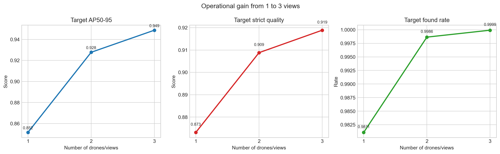
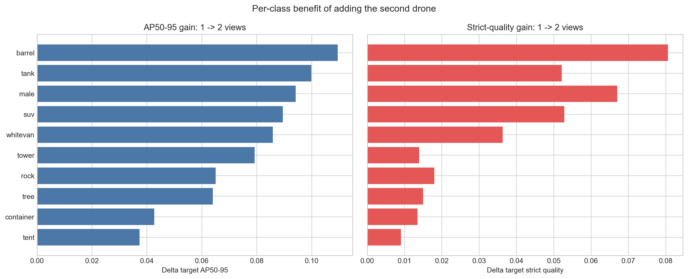
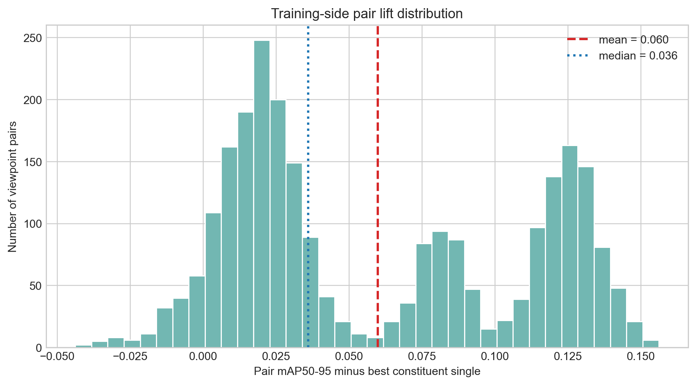
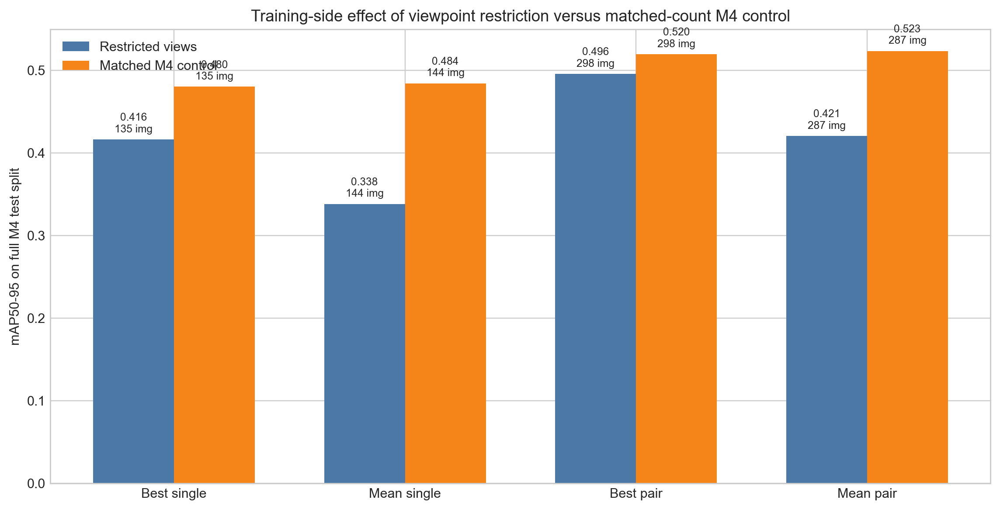
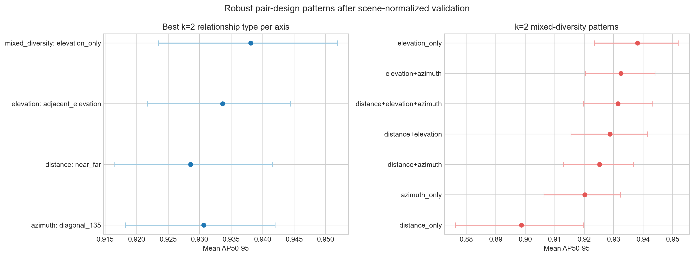
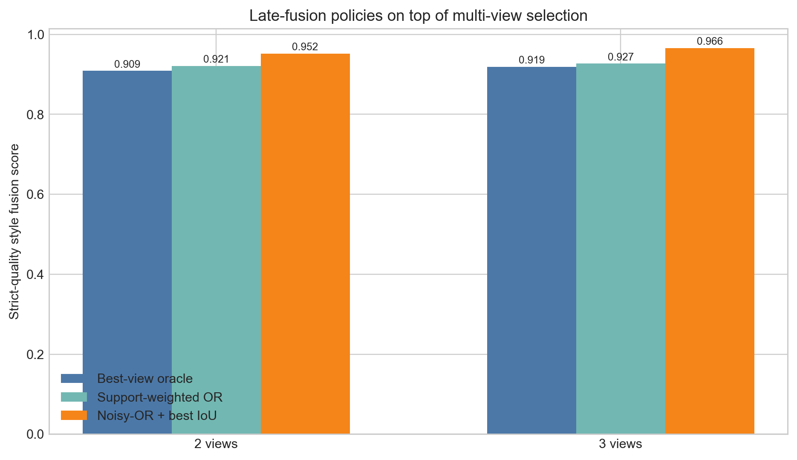

# Two drones vs one viewpoint: full analysis with literature, code, plots, and results

## Scope

This report answers the question:

- what is the added value of `2 drones / 2 viewpoints` versus `1 drone / 1 viewpoint`;
- why do extra viewpoints help or not help;
- what do the current project results actually prove;
- and how does this connect to the broader literature on UAV and multi-view object detection.

This analysis is intentionally split into four layers:

1. operational multiview value at inference time;
2. training-time value of viewpoint diversity;
3. robust pair-design patterns;
4. cross-view fusion value.

The reason for this split is important: "multiple drones" can help in more than one way, and mixing those mechanisms together would blur the conclusion.

## Short answer

The strongest conclusion from the current project is:

- the jump from `1` to `2` viewpoints is large and real;
- the jump from `2` to `3` viewpoints is much smaller;
- the second drone helps mainly through rescue-view behavior, complementary coverage, and a smaller but still real amount of cross-view corroboration;
- at training time, pair-restricted training is better than single-view restricted training, but broad viewpoint diversity in full-M4 controls is even better than both when image count is held fixed.

In plain terms:

- one good drone can work well if its viewpoint is chosen carefully;
- two drones are clearly better when the second one is chosen to be different, not duplicated;
- the best overall system is likely broad multiview training plus a carefully selected two-drone inference protocol.

## Files produced for this analysis

Code:

- `two_drone_vs_single_view_analysis/build_analysis.py`

Generated outputs:

- `two_drone_vs_single_view_analysis/outputs/operational_gain_curve.png`
- `two_drone_vs_single_view_analysis/outputs/class_gain_one_to_two.png`
- `two_drone_vs_single_view_analysis/outputs/pair_training_lift_distribution.png`
- `two_drone_vs_single_view_analysis/outputs/training_regime_comparison.png`
- `two_drone_vs_single_view_analysis/outputs/relationship_pattern_robustness_k2.png`
- `two_drone_vs_single_view_analysis/outputs/fusion_policy_comparison.png`
- `two_drone_vs_single_view_analysis/outputs/headline_metrics.csv`
- `two_drone_vs_single_view_analysis/outputs/literature_summary.csv`

The script can be rerun with:

```powershell
python two_drone_vs_single_view_analysis\build_analysis.py
```

## Why this question matters

In UAV detection, viewpoint is not a cosmetic variable. It changes:

- target scale;
- occlusion level;
- target aspect ratio and pose;
- background clutter;
- class confusion;
- and how much of the target is even visible.

That means the core question is not simply "is two better than one?" but:

- when does a second view add new information;
- when is it mostly redundant;
- and is the added value due to training diversity, operational rescue, or actual fusion.

## Literature review

The literature gives a strong conceptual frame for this project.

### UAV-specific detection difficulty

- [Du et al., ECCV 2018](https://openaccess.thecvf.com/content_ECCV_2018/html/Dawei_Du_The_Unmanned_Aerial_ECCV_2018_paper.html) established that UAV detection is harder than standard ground-view detection because altitude, camera view, occlusion, density, and motion vary strongly.
- [Wu et al., ICCV 2019](https://openaccess.thecvf.com/content_ICCV_2019/papers/Wu_Delving_Into_Robust_Object_Detection_From_Unmanned_Aerial_Vehicles_A_ICCV_2019_paper.pdf) explicitly argued that altitude and view-angle changes are UAV-specific nuisances that detection models must become robust to.

Implication for our project:

- a single viewpoint is expected to be brittle, because it sees only one slice of that nuisance space.

### Why multiview should help

- [Nassar et al., ICCV 2019](https://openaccess.thecvf.com/content_ICCV_2019/html/Nassar_Simultaneous_Multi-View_Instance_Detection_With_Learned_Geometric_Soft-Constraints_ICCV_2019_paper.html) showed that jointly using image appearance and geometric soft constraints across views can improve cross-view detection.
- [Chen et al., CVPR 2023, VEDet](https://openaccess.thecvf.com/content/CVPR2023/html/Chen_Viewpoint_Equivariance_for_Multi-View_3D_Object_Detection_CVPR_2023_paper.html) argued that multi-view consistency and viewpoint-equivariant learning improve multi-view object detection.
- [Daryani et al., CVPR 2025, CaMuViD](https://openaccess.thecvf.com/content/CVPR2025/html/Daryani_CaMuViD_Calibration-Free_Multi-View_Detection_CVPR_2025_paper.html) showed that calibration-free multi-view detection can still improve performance and handle occlusion.

Implication for our project:

- extra views should help not only because one of them might be lucky, but also because multi-view evidence can be mutually reinforcing.

### Why viewpoint selection matters more than brute-force view count

- [Hou et al., CVPR 2024](https://openaccess.thecvf.com/content/CVPR2024/html/Hou_Learning_to_Select_Views_for_Efficient_Multi-View_Understanding_CVPR_2024_paper.html) found that selecting the most helpful `2` or `3` views can preserve strong performance while reducing cost.
- [Vora et al., WACV 2023](https://openaccess.thecvf.com/content/WACV2023W/RWS/html/Vora_Bringing_Generalization_to_Deep_Multi-View_Pedestrian_Detection_WACVW_2023_paper.html) emphasized that multiview systems must generalize across camera count, camera position, and new scenes, because many models overfit one camera layout.

Implication for our project:

- the important question is not only "more views?", but "which views?" and "do the same patterns stay strong after scene-normalized validation?"

### Why training diversity and inference diversity are different questions

- [Dutta et al., CVPR 2024, MAVREC](https://openaccess.thecvf.com/content/CVPR2024/html/Dutta_Multiview_Aerial_Visual_RECognition_MAVREC_Can_Multi-view_Improve_Aerial_Visual_CVPR_2024_paper.html) showed that multi-view data is valuable for stronger aerial detection training.

Implication for our project:

- we should separate:
  - training-time viewpoint diversity;
  - inference-time use of multiple active viewpoints.

That is exactly why this report treats them as separate layers.

## Local project data and method

This report uses existing outputs from the project rather than retraining models from scratch.

### Data basis

From the existing swarm analysis outputs:

- `205` scenes
- `2214` image-view records
- `72` absolute viewpoints

### Analysis layer A: operational one-view vs two-view vs three-view

Source files:

- `m4_two_drone_operational_analysis/thesis_swarm_outputs/protocol_overall_summary.csv`
- `m4_marginal_viewpoint_value_analysis/outputs/multi_view_gain_summary.csv`
- `m4_marginal_viewpoint_value_analysis/outputs/class_multi_view_gain_summary.csv`

What this layer measures:

- keep the detector fixed;
- compare what happens when one, two, or three views are available for a scene;
- score the best target evidence under `1-of-k` style success rules.

Why this layer matters:

- this is the cleanest answer to the practical question "does a second drone help during deployment?"

### Analysis layer B: training-side pair vs single comparison

Source files:

- `viewpoint_data_separated/72_trained_models/reports/master_results.csv`
- `viewpoint_data_separated/m4_pair_results/snapshot/reports/master_results.csv`
- `viewpoint_data_separated/single_vs_pair_comparison______pairtrained_vs_singleviewbaselines/outputs/pair_vs_single_enriched.csv`
- `outputs/m4_matched_control_experiment/reports/master_results.csv`

What this layer measures:

- how a model trained on one viewpoint generalizes to the full M4 test split;
- how a model trained on two viewpoints does the same;
- how those restricted models compare to matched-count full-M4 controls.

Why this layer matters:

- it separates "pair helps because of more images" from "pair helps because of viewpoint diversity."

### Analysis layer C: robust pair-design patterns

Source files:

- `m4_viewpoint_selection_analysis/outputs/robustness/robust_relationship_recommendations.csv`

What this layer measures:

- not exact pair IDs alone;
- but stable relationship types such as:
  - azimuth spread;
  - elevation relation;
  - distance relation;
  - mixed diversity categories.

Why this layer matters:

- exact top pairs can have sparse support;
- relationship types are safer for thesis-level claims.

### Analysis layer D: fusion value

Source files:

- `m4_oracle_vs_box_fusion_comparison/outputs/overall_policy_comparison.csv`

What this layer measures:

- how much extra value comes from late fusion after view selection;
- best-view oracle vs support-weighted OR vs noisy-OR.

Why this layer matters:

- it tells us whether multiple drones help only by offering a rescue view, or also by providing fuseable corroboration.

## Why these metrics were chosen

The main metrics in this report are:

- `target AP50-95`
- `target strict quality`
- `target found rate`
- `pair mAP50-95 lift over best constituent single`
- `fusion gain over best-view oracle`

These were chosen because the mission question is target-centric.

We do **not** use ordinary mean image AP as the main decision metric, because:

- it does not directly capture rescue-view behavior;
- it does not reflect best available view quality;
- and in multi-view settings it can blur the real mission value of having a second camera.

## Results

## 1. Operational gain from 1 to 2 to 3 views



Headline results from `headline_metrics.csv`:

- `1 -> 2` target AP50-95 gain: `+0.0761`
- `1 -> 2` target strict-quality gain: `+0.0357`
- `1 -> 2` target found-rate gain: `+0.0175`
- two views already capture `78.4%` of the total available AP gain from `1 -> 3`
- two views already capture `78.0%` of the total available strict-quality gain from `1 -> 3`
- `2 -> 3` target AP50-95 gain is only `+0.0210`

Interpretation:

- the second view is the big step;
- the third view still helps, but much less;
- this is exactly the diminishing-returns structure that recent view-selection literature would lead us to expect.

The operational evidence therefore supports a thesis claim of the form:

- the best cost-benefit point in this dataset is around two views, not one and not a large uncontrolled view count.

## 2. Which object classes gain the most from a second drone?



Largest `1 -> 2` gains from the class-level summary:

- `barrel`: `+0.1094` target AP50-95, `+0.0806` strict quality
- `tank`: `+0.0999` target AP50-95, `+0.0521` strict quality
- `male`: `+0.0942` target AP50-95, `+0.0670` strict quality
- `suv`: `+0.0895` target AP50-95, `+0.0528` strict quality
- `whitevan`: `+0.0859` target AP50-95, `+0.0363` strict quality

Smallest gains:

- `tent`
- `container`
- `tower`

Interpretation:

- the classes that gain most are the ones for which viewpoint sensitivity, partial occlusion, scale, or local confusion matter more;
- the second drone is most valuable where single-view ambiguity is strongest.

This again matches the multiview literature: extra views are most useful when a single image can hide or distort the target.

## 3. Training-side evidence: do pair viewpoints help the model?



Training-side pair-versus-single summary:

- mean pair lift over best constituent single: `+0.0598` mAP50-95
- median pair lift: `+0.0360`
- fraction of pairs beating their best constituent single: `93.9%`

Interpretation:

- pair-restricted training is usually better than single-view restricted training;
- this is not a rare corner case, but the dominant pattern.

However, that does **not** mean "train only on two viewpoints" is optimal.

## 4. Matched-count controls: image count versus viewpoint diversity



Matched-count comparison:

- best restricted single: `0.416`
- matched-count M4 control at `135` images: `0.480`
- mean restricted single: `0.338`
- matched-count M4 control at `144` images: `0.484`
- best restricted pair: `0.496`
- matched-count M4 control at `298` images: `0.520`
- mean restricted pair: `0.421`
- matched-count M4 control at `287` images: `0.523`

Interpretation:

- restricted pair training beats restricted single training;
- but broad full-M4 viewpoint diversity beats both when image count is controlled;
- therefore the real winner at training time is not "exactly two viewpoints";
- it is broader viewpoint diversity.

This is a key thesis-safe conclusion:

- `two viewpoints are valuable operationally, but broad multiview diversity is even more valuable for training generalization`

## 5. Robust pair-design patterns



Best relationship types at `k=2`:

- best azimuth pattern: `diagonal_135`, mean AP50-95 `0.9306`
- best distance pattern: `near_far`, mean AP50-95 `0.9285`
- best elevation pattern: `adjacent_elevation`, mean AP50-95 `0.9336`
- best mixed-diversity pattern: `elevation_only`, mean AP50-95 `0.9381`

Weakest mixed-diversity pattern:

- `distance_only`, mean AP50-95 `0.8987`

Interpretation:

- two drones should not be duplicates;
- varying elevation is especially strong;
- mixing distance and elevation is usually better than changing distance alone;
- pure distance-only diversification is the weakest design choice in these scene-normalized results.

This is important because it tells us **how** to deploy drone 2:

- not as a copy of drone 1;
- but as a complementary viewpoint with meaningful geometric difference.

## 6. Fusion value beyond best-view rescue



For `2` views:

- best-view oracle: `0.9088`
- support-weighted OR: `0.9212`
- noisy-OR + best IoU: `0.9515`

So fusion gives:

- `+0.0124` for support-weighted OR over best-view oracle
- `+0.0427` for noisy-OR over best-view oracle

Interpretation:

- if multiple drones helped only via rescue-view behavior, support-weighted fusion would add little or nothing;
- but it does add value, which means at least some pairings contain corroborating cross-view evidence.

The support-weighted gain is modest rather than huge, so the current best interpretation is:

- most of the two-drone value still comes from rescue/complementarity;
- but there is also a smaller, real corroboration effect that a deployable fusion rule can exploit.

## What this means mechanistically

The results point to three distinct mechanisms.

### Mechanism 1: rescue-view behavior

The first view misses or underperforms, and the second view recovers the target.

This is the dominant reason why `1 -> 2` gains are so large.

### Mechanism 2: complementary geometry

The second view exposes a different elevation, distance, or azimuth relationship, reducing the chance that both views fail for the same reason.

This explains why relationship design matters so much and why "distance only" is weaker than richer geometric diversity.

### Mechanism 3: cross-view corroboration

When two views both carry meaningful evidence, fusion can outperform best-view-only selection.

This effect is smaller than rescue-view behavior, but it is clearly present in the fusion outputs.

## How this aligns with the literature

The project findings are consistent with the literature in a very specific way.

### Strong agreement

- The UAV literature says viewpoint variation is a core nuisance.
  Our single-view vulnerability confirms that.
- The multiview literature says extra views help with occlusion and consistency.
  Our `1 -> 2` gains confirm that.
- The efficient-view-selection literature says a small number of carefully chosen views is often enough.
  Our result that two views already capture about `78%` of the total `1 -> 3` gain confirms that.
- The generalization literature says exact camera layouts should not be over-trusted.
  Our use of scene-normalized relationship analysis confirms that exact top pairs alone are not enough.

### Important nuance beyond the literature

Our project adds a useful distinction that many papers leave implicit:

- multiview value at training time;
- multiview value at inference time;
- and multiview value from fusion

are related but not identical.

That distinction matters a lot for practical system design.

## Best answer to the original question

If the question is:

- `what is the added value of two drones versus one viewpoint?`

then the best evidence-based answer is:

- two drones give a meaningful and practically relevant improvement;
- most of that improvement appears already with the second view;
- the second drone should be placed to add complementary geometry, not duplicate the first;
- the strongest design cue in these data is to vary elevation and combine viewpoint factors rather than only changing distance;
- if compute or budget is limited, two good views are likely the best compromise;
- if training is under our control, broader viewpoint diversity across M4 is even more important than restricting training to a single pair.

## Practical recommendation

### If only one drone is available

- choose a strong, target-favorable viewpoint;
- prefer informative near or mid views over arbitrary coverage;
- expect fragility to occlusion or pose.

### If two drones are available

- do not duplicate the same view;
- deliberately create complementary geometry;
- prioritize elevation difference and mixed diversity;
- use a conservative fusion rule on top of best-view selection if deployment allows it.

### If the full system can be redesigned

- train on broad multiview data;
- deploy with two carefully selected drones/views;
- use late fusion as an upgrade rather than the primary source of gain.

## Limitations

This report should be read with three boundaries in mind.

### 1. Operational layer is not retraining

The one-vs-two-vs-three comparison holds the detector fixed and asks what view availability adds at inference time.

That is the right setup for operational value, but it is not the same as training a new multiview model.

### 2. Exact viewpoint pairs can be sparse

Some exact top pairs have small scene support, which is why the relationship-type analysis is the safer place for general design claims.

### 3. Current fusion is conservative

The late-fusion comparison does not use full geometric reprojection or a dedicated learned multiview detector.

That means the current fusion gains are probably a lower bound on what a stronger collaborative perception stack could do.

## Recommended next experiments

The cleanest next steps are:

1. Run a matched-scene comparison for a shortlist of exact top pairs versus exact weak pairs, with bootstrap confidence intervals.
2. Build a policy experiment where drone 2 is chosen adaptively after drone 1 confidence is observed.
3. Add a geometry-aware fusion baseline if calibration or reprojection becomes available.
4. Evaluate whether the best two-view relationship pattern remains stable on a scene-held-out split.
5. Compare fixed two-view pairs against a learned view-selection policy.
6. If possible, connect operational pair selection to battery or time cost so the viewpoint gain can be translated into mission utility.

## Final conclusion

The current project evidence supports the following thesis-level statement:

`The move from one viewpoint to two viewpoints is the most important multiview step in this dataset, and its value comes mainly from rescue-view behavior and complementary geometry, with a smaller but real contribution from cross-view corroboration.`

And the strongest practical conclusion is:

`If a second drone is available, it should be used to add a complementary viewpoint, not to replicate the first viewpoint.`
